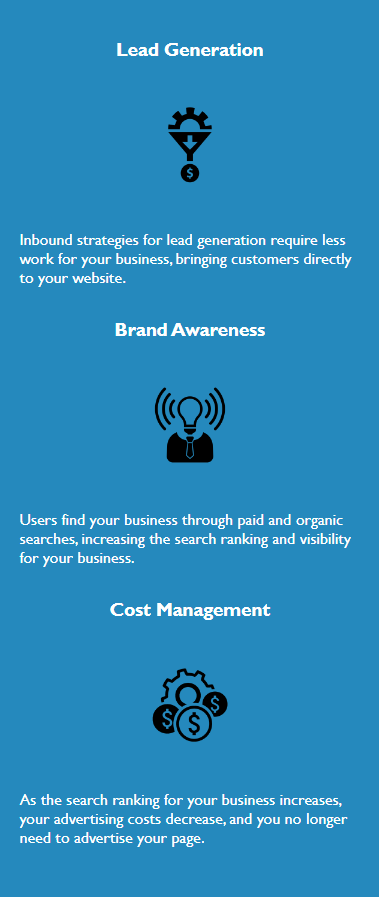

# Horiseon can help your business succeed.  Read how.

## Description

This site generalizes popular topics in today's generation of the business world.

## Table of contents

- [Installation](#installation)
- [Usage](#usage)
- [Credits](#credits)
- [License](#license)

## Installation

N/A

## Usage

Discusses how Horiseon can help a business grow through social influence.

## Credits

### [Horiseon](https://zmag33z.github.io/week-1-challenge/)

## License

### [GNU GENERAL PUBLIC LICENSE:  Version 3, 29 June 2007](https://zmag33z.github.io/week-1-challenge/assets/license.md)
